<!--
  Profile README for github.com/arman-mahabad.
  Copy README.md and the assets folder to the root of the repo named arman-mahabad.
  To add a project, use the templates at the bottom of this file.
-->

<a href="https://byarman.site">
  <picture>
    <source media="(prefers-color-scheme: dark)" srcset="assets/header-dark.svg">
    <source media="(prefers-color-scheme: light)" srcset="assets/header-light.svg">
    
  </picture>
</a>

**AI Product Builder** &nbsp;·&nbsp; Slemani, Kurdistan

I design and build products, and the AI systems behind them. Then I put them live and keep them working.

**6** sites live on their own domains &nbsp;·&nbsp; **5,000+** automated tests on one of them &nbsp;·&nbsp; **0** AI models that check their own work

[byarman.site](https://byarman.site) &nbsp;·&nbsp; [LinkedIn](https://www.linkedin.com/in/arman-mahabad) &nbsp;·&nbsp; [arman@byarman.site](mailto:arman@byarman.site)

## Made by Arman 

Everything I make carries a small signature, "Made by Arman ↗". All of them lead back to [byarman.site](https://byarman.site).

| | Work | Kind | Where |
|:--|:--|:--|:--|
| 01 | **Meds.krd** | Study platform with an AI lecture pipeline | [meds.krd ↗](https://www.meds.krd) |
| 02 | **Kunji** | AI copilot for customer-care replies | Prototype |
| 03 | **Swaplane** | Shift-swap app with exact, fair matching | [swaplane.site ↗](https://swaplane.site) |
| 04 | **ArmanLeads** | Marketing business for US dental practices | [armanleads.com ↗](https://armanleads.com) |
| 05 | **ZMS** | Phone-parts shop in Sorani Kurdish | [zandms.store ↗](https://zandms.store) |
| 06 | **Photography** | Photographs from Slemani, and SuliBooth | [arman.photography ↗](https://arman.photography) |
| 07 | **byarman.site** | My site, and the map of all of this | [byarman.site ↗](https://byarman.site) |

## How I work

**I only say what I can prove.** Meds.krd keeps an evidence log: every public claim, the date it was checked, how it was checked, and what the check does not prove. Every claim on this page has a file behind it.

**AI where it helps. Plain code where it has to be right.** Swaplane matches shifts with exact math, not a model's guess. Kunji's safety rules are compiled code, because a prompt can be talked out of a rule.

**A person has the last word.** Kunji drafts replies but never sends one by itself. In the Lecture Machine, anything that fails twice waits for a person.

**Finished means live.** Six of these run on their own domains, and I keep them running.

## The work

### 01 &nbsp;Meds.krd

**A study platform for medical students in Kurdistan: their own lectures, a plan for today, and practice that remembers what each student gets wrong.**

Inside it runs the Lecture Machine. It turns a lecture into readable parts and practice questions. Several AI models from different companies share the work, and none of them checks its own writing.

- More than 5,000 automated tests, unit and browser.
- An evidence log with 400+ dated entries.

`React` `TypeScript` `Vite` `Supabase` `Postgres` `Vitest` `Playwright` `Sentry` `LLM APIs`

### 02 &nbsp;Kunji

**A working prototype of an AI copilot that helps customer-care agents write and check their replies.** It never sends anything by itself, and it comes with a workspace for measuring how well it works.

- Its safety rules are TypeScript with unit tests. Three of them block a reply outright, such as one that would show a customer's personal data.
- Each edit to a draft is saved as a labelled example: the input, the model's draft, and the version a person preferred. The evaluation set builds itself.
- The rules that warn in real time also score the benchmark, so what gets measured and what gets enforced can't drift apart.

`Next.js` `TypeScript` `Prisma` `Zod` `Vitest` `LLM APIs`

### 03 &nbsp;Swaplane

**A shift-swap app for teams that work in shifts. You say how you want your week to look, and it finds swaps that are fair to both people.**

Picking the best set of swaps for a whole team is a known math problem. Swaplane solves it exactly with the blossom matching algorithm, in well under a second. No AI decides who swaps, so every match can be explained.

- Property tests run the engine on generated teams. They check that every suggestion keeps every rule, and that the same input always gives the same answer.

`Next.js` `TypeScript` `Tailwind` `Radix` `Vitest` `fast-check` `Playwright` `axe`

### 04 &nbsp;ArmanLeads

**A marketing business for US dental practices. I built it and I run it: the website, the way it researches practices, and the CRM behind it.**

Every fact the research finds is saved with its source. Nothing goes out that can't be traced back.

`HTML` `CSS` `Cloudflare Pages` `React` `Vite` `Supabase` `Recharts`

### 05 &nbsp;ZMS

**An online shop for phone parts, in Sorani Kurdish.**

No Kurdish word on it was made up by AI. Each term was found on real Kurdish shops, or checked by a native speaker before it went live.

### 06 &nbsp;Photography

**Photographs from Slemani, on a site I designed and built.** SuliBooth lives there too: a wooden photo booth I built for events in Slemani.

### 07 &nbsp;byarman.site

**My own site, and the map of everything I make.** Every "Made by Arman ↗" on my other work leads to it.

`Astro` `Cloudflare Pages`

## Tools

| Area | Tools |
|:--|:--|
| **AI systems** | Multi-model LLM pipelines · evaluation sets · rules in code · human review |
| **Web and apps** | TypeScript · React · Next.js · Astro · Vite · Tailwind |
| **Data** | Supabase · Postgres · Prisma |
| **Testing** | Vitest · Playwright · fast-check · axe |
| **Shipping** | Cloudflare · Vercel · Sentry |
| **Design** | Brand identity · interface design · interface writing · photography |

**Now:** building the next version of Meds.krd.

 

<!--
  ─────────────────────────────────────────────────────────────
  ADD A PROJECT (two steps, about five minutes)

  1. Add one row to the "Made by Arman" table. Keep the numbers in order.

  | 08 | **Name** | What it is, in six words or fewer | [domain ↗](https://domain) |

  2. Copy this block to the end of "The work":

  ### 08 &nbsp;Name

  **One sentence: what it is and who it is for.**

  One or two sentences about the most interesting decision, and why you made it.

  `Tool` `Tool` `Tool`

  Then: change the "6 sites" number at the top if the new one has its own domain.

  Rules: say only what you can prove. No prices, no user numbers without proof,
  no "passionate", no exclamation marks.
  ─────────────────────────────────────────────────────────────

  READY FOR LATER: BUNBINN. Move these in when bunbinn.art is live and Bunny says yes.

  | 08 | **BUNBINN** | Portfolio for the artist Bunny | [bunbinn.art ↗](https://bunbinn.art) |

  ### 08 &nbsp;BUNBINN

  **A portfolio and commission site for the artist Bunny. I designed and built it; the artwork is hers.**

  `Next.js` `TypeScript` `Supabase` `Motion` `Resend`
-->
